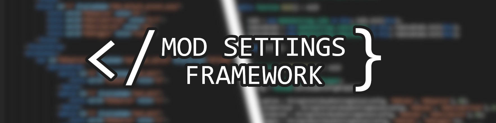

<br>

[Synopsis](#synopsis)

[Overview](#overview)

[Instructions for mod users](#instructions-for-mod-users)

[Instructions for mod developers](#instructions-for-mod-developers)

[Remarks](#remarks)

[Documentation](#documentation)

---

## Synopsis
Framework for modding Witcher 3 that simplifies the pipeline of using mod settings by generating code based directly on mod menu XML and providing extendible interface for reacting to changes of settings.

## Overview
Witcher 3 allows for creating custom mod menus which provide an interface between the mod developer and the end user to further customize their experience. The way settings are accessed in game's scripts is not complicated, but can often result in very boilerplaty code and situations when settings can be fetched improperly simply due to some typo. This framework is trying to midigate that.

First part of this framwork is the menu xml parser. It turns the mod menu xml into WitcherScript code which mirrors the structure of customisable variables in the xml and assures on compile time that the developer uses their variables properly - no way for typos or bad type cast.

Second part of this framework is WitcherScript code that updates generated by parser settings class and even notifies you about it.

## Instructions for mod users

1. Check for [framework version](#framework-version-support) you need
2. Go to the [releases page](https://github.com/SpontanCombust/tw3-settings-framework/releases)
3. Download `TW3_Mod_Settings_Framework_modSettingsFramework.zip` from the newest version or version specified by the developer
4. Install it like any other Witcher 3 mod by dropping what's inside into your `Mods` folder
5. Use Script Merger to solve any conflicts

## Instructions for mod developers

1. Check for [framework version](#framework-version-support) you need

2. Install `TW3_Mod_Settings_Framework_modSettingsFramework.zip` dependency from the [releases page](https://github.com/SpontanCombust/tw3-settings-framework/releases) and use script merger if necessary


3. Download `TW3_Mod_Settings_Framework_Parser.zip` and unpack it anywhere. Use the `settings_parser.exe` program with the menu xml of your mod

```shell
./settings_parser -f ../../doc/mod-menu.xml -m MyModSettings -v 1.23 --omit-prefix=MOD
Group MODtab2 at line 40, column 6 has no vars and will be ignored.
Successfully parsed ../../doc/mod-menu.xml into ../../doc/mod-menu.ws
```
Parser at minimum takes a path to the menu xml file (`-f` flag) and a name you wish your settings class to have (`-m` flag).
To see all the possible options that can be used with the parser use the `--help` (shorhand `-h`) option or check the latest [parser CLI specification](doc/cli_specification.md). 

[Example mod xml](doc/mod-menu.xml)

[Generated WitcherScript code](doc/mod-menu.ws)

<br>

4. Add generated script file to your mod structure 
   
5. Use the settings object in your mod

Let's first look at an example of using settings with what vanilla game provides.
```js
var config : CInGameConfigWrapper = theGame.GetInGameConfigWrapper();

if(config.GetVarValue('MODtab1', 'MODtoggle'))
{
	doSomething();
	config.SetVarValue('MODtab1', 'MODsliderInt', IntToString(50));
	theGame.SaveUserSettings();
}
```

Now let's see how the above can be improved with the framework. 
```js
var settings : MyModSettings = GetMyModSettings();

if(settings.tab1.toggle)
{
	doSomething();
	settings.tab1.sliderInt = 50;
	settings.WriteSettings();
}
```

The structure of the generated settings class is meant to resemble the structure of the XML. The class contains variables analogous to XML's Group nodes. Those variables in turn contain variables which are equivalent to individual Var nodes. Their types are appropriate, for example a variable for TOGGLE will be of type bool and a SLIDER variable will be either int or float depending on whether said slider can produce fractions. <br>
Now instead of using CInGameConfigWrapper's methods to access user configuration you can use this dedicated settings object in a less boiler-platy way.
Aside from having simple variables in place of function calls the framework provides such features as value validation and generating enums from options vars. Be sure to check out the [documentation](#documentation) and try experimenting with different configurations.

<br>

6. (Optional) Extend settings master

If the basic functionality that framework classes provided is not enough for you you can extend the settings class generated by the parser and use that child class instead.
The most common usage of this would be overriding `ReadSettings()` method to run arbitrary code whenever the settings class gets updated. To see all the functions available for overriding refer to the [class specification](doc/class_specification.md) or code itself.


## Remarks

### Framework version support:
- 0.4+ for game version 4.04
- 0.3.0 - 0.3.1 for game version 4.03
- 0.1.0 - 0.2.0 for game version 1.32 (requires [Community Patch - Base](https://www.nexusmods.com/witcher3/mods/3652))


## Documentation
[WitcherScript class specification](doc/class_specification.md)

[Parser CLI specification](doc/cli_specification.md)

[Samples](samples)